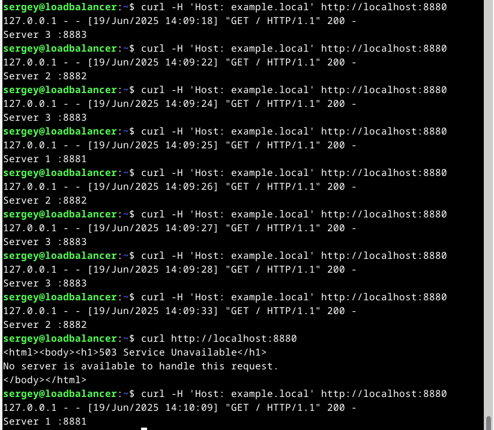

# Домашнее задание к занятию 2 «Кластеризация и балансировка нагрузки». Потапчук Сергей

### Цель задания
В результате выполнения этого задания вы научитесь:
1. Настраивать балансировку с помощью HAProxy
2. Настраивать связку HAProxy + Nginx

------

### Чеклист готовности к домашнему заданию

1. Установлена операционная система Ubuntu на виртуальную машину и имеется доступ к терминалу
2. Просмотрены конфигурационные файлы, рассматриваемые на лекции, которые находятся по [ссылке](2/)

------

### Инструкция по выполнению домашнего задания

1. Сделайте fork [репозитория c шаблоном решения](https://github.com/netology-code/sys-pattern-homework) к себе в Github и переименуйте его по названию или номеру занятия, например, https://github.com/имя-вашего-репозитория/gitlab-hw или https://github.com/имя-вашего-репозитория/8-03-hw).
2. Выполните клонирование этого репозитория к себе на ПК с помощью команды git clone.
3. Выполните домашнее задание и заполните у себя локально этот файл README.md:
   - впишите вверху название занятия и ваши фамилию и имя;
   - в каждом задании добавьте решение в требуемом виде: текст/код/скриншоты/ссылка;
   - для корректного добавления скриншотов воспользуйтесь инструкцией [«Как вставить скриншот в шаблон с решением»](https://github.com/netology-code/sys-pattern-homework/blob/main/screen-instruction.md);
   - при оформлении используйте возможности языка разметки md. Коротко об этом можно посмотреть в [инструкции по MarkDown](https://github.com/netology-code/sys-pattern-homework/blob/main/md-instruction.md).
4. После завершения работы над домашним заданием сделайте коммит (git commit -m "comment") и отправьте его на Github (git push origin).
5. Для проверки домашнего задания преподавателем в личном кабинете прикрепите и отправьте ссылку на решение в виде md-файла в вашем Github.
6. Любые вопросы задавайте в чате учебной группы и/или в разделе «Вопросы по заданию» в личном кабинете.

------

### Задание 1
- Запустите два simple python сервера на своей виртуальной машине на разных портах
- Установите и настройте HAProxy, воспользуйтесь материалами к лекции по [ссылке](2/)
- Настройте балансировку Round-robin на 4 уровне.
- На проверку направьте конфигурационный файл haproxy, скриншоты, где видно перенаправление запросов на разные серверы при обращении к HAProxy.

### Решение

Устанавливаем HAProxy и cURL
```bash
sudo apt install -y haproxy
sudo apt install -y curl
```
Запускаем и проверяем два Python сервера
```bash
mkdir http-1
mkdir http-2
cd http-1
vim index.html

# Содержимое index.html
Server 1 :8881

python3 -m http.server 8881 --bind 0.0.0.0 &
cd ../http-2
vim index.html

# Содержимое index.html
Server 2 :8882

python3 -m http.server 8882 --bind 0.0.0.0 &
cd

# Проверяем
curl http://localhost:8881
curl http://localhost:8882
```

Сохраню старый конфигурационный файл HAProxy, и создам новый: [/etc/haproxy/haproxy.cfg](task-1/haproxy.cfg)
```bash
sudo mv /etc/haproxy/haproxy.cfg /etc/haproxy/haproxy.cfg.bak
sudo vim /etc/haproxy/haproxy.cfg
```

следующего содержания:
```
global
    log stdout format raw local0
    maxconn 4096
    user haproxy
    group haproxy
    daemon

defaults
    mode tcp

frontend ft_web
    bind *:8880
    default_backend bk_web

backend bk_web
    balance roundrobin
    server server1 127.0.0.1:8881 check
    server server2 127.0.0.1:8882 check
```

Не забываем перечитать изменения
```
sudo systemctl reload haproxy.service
```

Тестируем результат
```
curl http://localhost:8880
```


---

### Задание 2
- Запустите три simple python сервера на своей виртуальной машине на разных портах
- Настройте балансировку Weighted Round Robin на 7 уровне, чтобы первый сервер имел вес 2, второй - 3, а третий - 4
- HAproxy должен балансировать только тот http-трафик, который адресован домену example.local
- На проверку направьте конфигурационный файл haproxy, скриншоты, где видно перенаправление запросов на разные серверы при обращении к HAProxy c использованием домена example.local и без него.

### Решение

Добавляем еще один Python сервер
```bash
mkdir http-3
cd http-3
vim index.html

# Содержимое index.html
Server 3 :8883

python3 -m http.server 8883 --bind 0.0.0.0 &
cd
```

Меняем файл [/etc/haproxy/haproxy.cfg](task-2/haproxy.cfg) (mode http, фильтр и веса)
```
global
    log stdout format raw local0
    maxconn 4096
    user haproxy
    group haproxy
    daemon

defaults
    mode http

frontend ft_web
    bind *:8880
    acl host_example_local hdr(host) -i example.local
    use_backend bk_web if host_example_local

backend bk_web
    balance roundrobin
    server server1 127.0.0.1:8881 check weight 2
    server server2 127.0.0.1:8882 check weight 3
    server server3 127.0.0.1:8883 check weight 4
```

Перезагружаем сервер (reload не освобождает порт, я думаю в связи с изменением уровня tcp-http, или можно было использовать другой)
```bash
sudo systemctl restart haproxy.service
```

Проверяем
```bash
curl -H 'Host: example.local' http://localhost:8880
curl http://localhost:8880
```



---

## Задания со звёздочкой*
Эти задания дополнительные. Их можно не выполнять. На зачёт это не повлияет. Вы можете их выполнить, если хотите глубже разобраться в материале.

---

### Задание 3*
- Настройте связку HAProxy + Nginx как было показано на лекции.
- Настройте Nginx так, чтобы файлы .jpg выдавались самим Nginx (предварительно разместите несколько тестовых картинок в директории /var/www/), а остальные запросы переадресовывались на HAProxy, который в свою очередь переадресовывал их на два Simple Python server.
- На проверку направьте конфигурационные файлы nginx, HAProxy, скриншоты с запросами jpg картинок и других файлов на Simple Python Server, демонстрирующие корректную настройку.

### Решение

Установил Nginx и заменил содержание его конфигурационного файла [/etc/nginx/sites-available/default](task-3/default)
```bash
sudo apt install -y nginx
sudo mv /etc/nginx/sites-available/default /etc/nginx/sites-available/default.bak
sudo vim /etc/nginx/sites-available/default
```

на следующее
```
server {
    listen 80;
    server_name example.local;

    location ~* \.jpe?g$ {
        root /var/www/images;
        try_files $uri =404;
    }

    location / {
        proxy_pass http://127.0.0.1:8880;
        proxy_set_header Host $host;
    }
}
```

Создал каталог /var/www/images, настроил права, и скопировал туда несколько картинок.
```bash
sudo mkdir -p /var/www/images
sudo cp ~/Downloads/*.jpg /var/www/images
sudo chown -R www-data:www-data /var/www/images
sudo chmod -R 755 /var/www
```

Проверил и перечитал конфигурацию Nginx. 
```
sudo nginx -t
sudo systemctl reload nginx.service
```
В [конфигурации HAProxy](task-3/haproxy.cfg) оставил три python сервера в режиме http как в предыдущем задании.

Проверяю


---

### Задание 4*
- Запустите 4 simple python сервера на разных портах.
- Первые два сервера будут выдавать страницу index.html вашего сайта example1.local (в файле index.html напишите example1.local)
- Вторые два сервера будут выдавать страницу index.html вашего сайта example2.local (в файле index.html напишите example2.local)
- Настройте два бэкенда HAProxy
- Настройте фронтенд HAProxy так, чтобы в зависимости от запрашиваемого сайта example1.local или example2.local запросы перенаправлялись на разные бэкенды HAProxy
- На проверку направьте конфигурационный файл HAProxy, скриншоты, демонстрирующие запросы к разным фронтендам и ответам от разных бэкендов.

### Решение

Добавляем еще один Python сервер
```bash
mkdir http-4
cd http-4
vim index.html

# Содержимое index.html
Server 4 :8884

python3 -m http.server 8884 --bind 0.0.0.0 &
cd
```

Меняем файл [/etc/haproxy/haproxy.cfg](task-4/haproxy.cfg)
```
global
    log stdout format raw local0
    maxconn 4096
    user haproxy
    group haproxy
    daemon

defaults
    mode http

frontend ft_web
    bind *:8880
    acl host_example1_local hdr(host) -i example1.local
    acl host_example2_local hdr(host) -i example2.local
    use_backend bk_web1 if host_example1_local
    use_backend bk_web2 if host_example2_local

backend bk_web1
    balance roundrobin
    server server1 127.0.0.1:8881 check
    server server2 127.0.0.1:8882 check

backend bk_web2
    balance roundrobin
    server server3 127.0.0.1:8883 check
    server server4 127.0.0.1:8884 check
```

Не забываем перечитывать конфигурацию.
```bash
sudo systemctl reload haproxy.service
```

Конфигурация Nginx [/etc/nginx/sites-available/default](task-4/default) осталась та же.

Проверяю


------

### Правила приема работы

1. Необходимо следовать инструкции по выполнению домашнего задания, используя для оформления репозиторий Github
2. В ответе необходимо прикладывать требуемые материалы - скриншоты, конфигурационные файлы, скрипты. Необходимые материалы для получения зачета указаны в каждом задании.

------

### Критерии оценки

- Зачет - выполнены все задания, ответы даны в развернутой форме, приложены требуемые скриншоты, конфигурационные файлы, скрипты. В выполненных заданиях нет противоречий и нарушения логики
- На доработку - задание выполнено частично или не выполнено, в логике выполнения заданий есть противоречия, существенные недостатки, приложены не все требуемые материалы.
